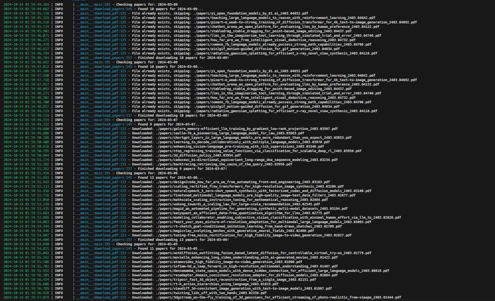

# HuggingFace Daily Papers Scraper
> Downloads papers on the HuggingFace Daily Papers page (https://huggingface.co/papers).

<!-- [![NPM Version][npm-image]][npm-url]
[![Build Status][travis-image]][travis-url]
[![Downloads Stats][npm-downloads]][npm-url] -->

Can be used to grab the papers from the day before or to grab all papers from previous dates.



## Installation

git clone this repo:

```
git clone https://github.com/yzsshen/daily-paper-scraper.git
```

install requirements:
```
pip install -r requirements.txt
```
<!-- OS X & Linux:

```sh
npm install my-crazy-module --save
```

Windows:

```sh
edit autoexec.bat
``` -->

## Usage example

To get papers from the day before, run
```
python main.py daily
```

To get papers from all previous dates, run
```
python main.py historical
```

<!-- _For more examples and usage, please refer to the [Wiki][wiki]._ -->

<!-- ## Development setup

Describe how to install all development dependencies and how to run an automated test-suite of some kind. Potentially do this for multiple platforms.

```sh
make install
npm test
``` -->

## Release History

* 0.2.1
    * CHANGE: Update docs (module code remains unchanged)
* 0.2.0
    * CHANGE: Remove `setDefaultXYZ()`
    * ADD: Add `init()`
* 0.1.1
    * FIX: Crash when calling `baz()` (Thanks @GenerousContributorName!)
* 0.1.0
    * The first proper release
    * CHANGE: Rename `foo()` to `bar()`
* 0.0.1
    * Work in progress

## Things to Do
* Work in Progress

## Known Issues
* Issue 
  * Issue Details

## Meta

Yue Shen – yzs.shen@gmail.com
<!-- – [@YourTwitter](https://twitter.com/dbader_org)  -->
Distributed under the MIT license. See ``LICENSE`` for more information.

[https://github.com/yzsshen](https://github.com/yzsshen)

## Contributing

1. Fork it (<https://github.com/yzsshen/daily-paper-scraper/fork>)
2. Create your feature branch (`git checkout -b feature/fooBar`)
3. Commit your changes (`git commit -am 'Add some fooBar'`)
4. Push to the branch (`git push origin feature/fooBar`)
5. Create a new Pull Request

<!-- Markdown link & img dfn's -->
<!-- [npm-image]: https://img.shields.io/npm/v/datadog-metrics.svg?style=flat-square
[npm-url]: https://npmjs.org/package/datadog-metrics
[npm-downloads]: https://img.shields.io/npm/dm/datadog-metrics.svg?style=flat-square
[travis-image]: https://img.shields.io/travis/dbader/node-datadog-metrics/master.svg?style=flat-square
[travis-url]: https://travis-ci.org/dbader/node-datadog-metrics
[wiki]: https://github.com/yourname/yourproject/wiki -->

